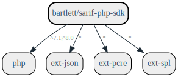

# Getting started

## Requirements

* PHP 7.1 or greater
* ext-json
* ext-pcre
* ext-spl



Generated with [clue/graph-composer](https://github.com/clue/graph-composer)

## Installation

### With Composer

Install the SARIF PHP SDK with [Composer](https://getcomposer.org/).

```shell
composer require bartlett/sarif-php-sdk
```

### With Git

The SARIF PHP SDK can be directly used from [GitHub](https://github.com/llaville/sarif-php-sdk.git)
by cloning the repository into a directory of your choice.

```shell
git clone https://github.com/llaville/sarif-php-sdk.git
```
